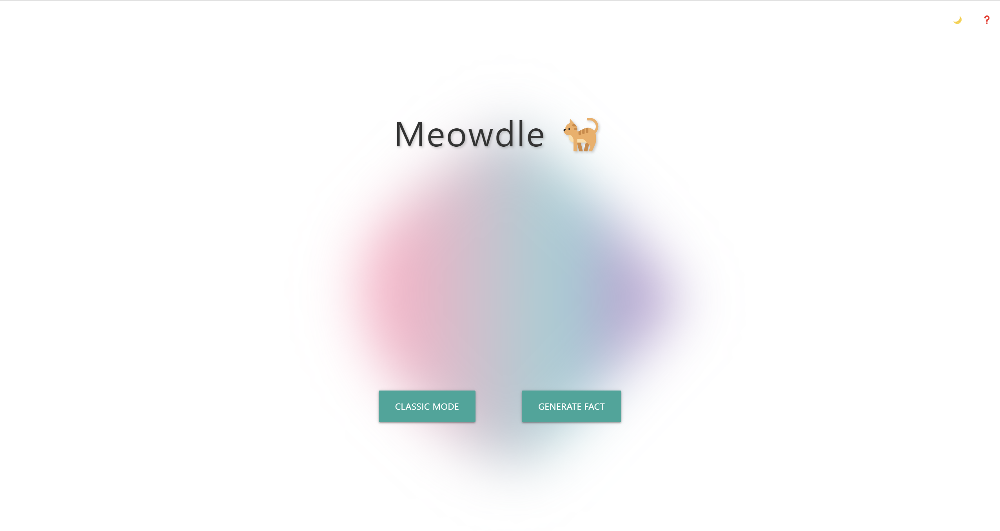
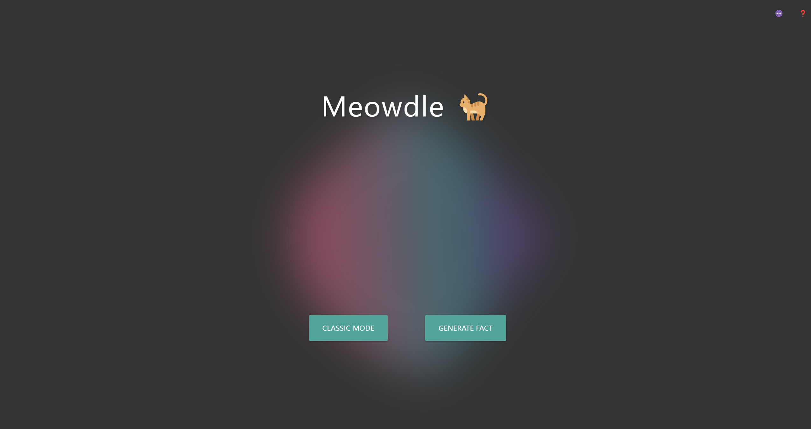
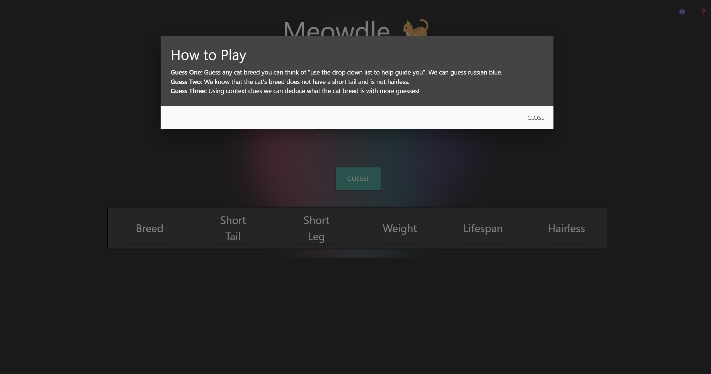
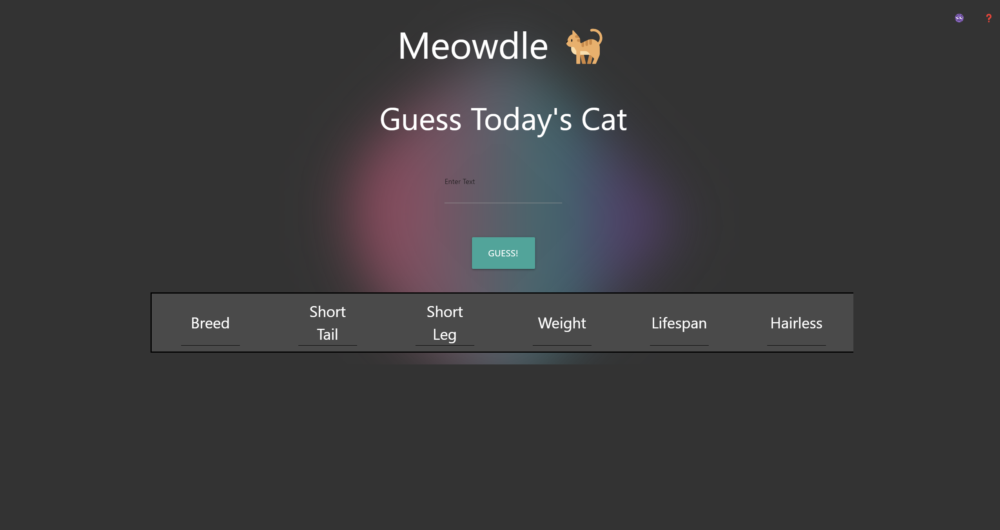
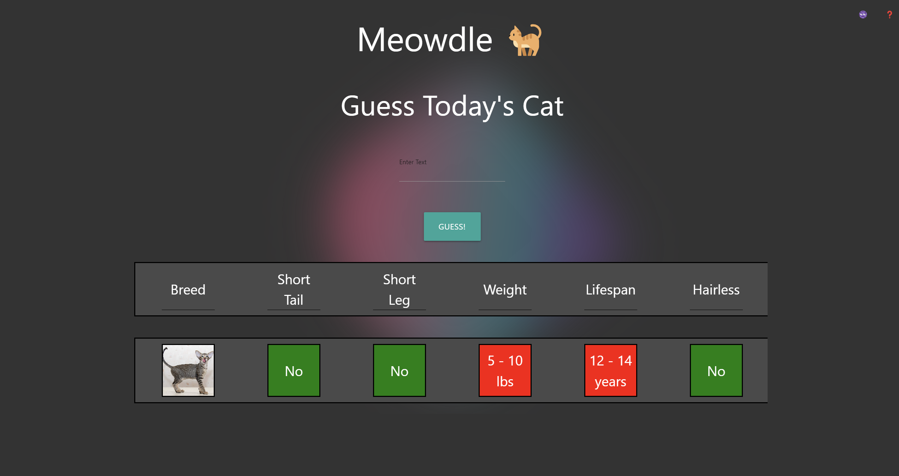
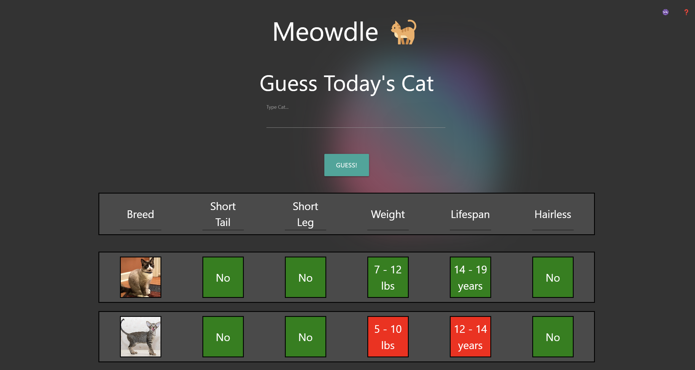

# Meowdle 

## Description
Cat Guessing Game is a web application that works like WORDLE but instead uses cats as the element being guessed. The user has to guess the name of a cat based on its attributes, such as breed, weight, lifespan, and hairlessness. The user can also view a random cat image and fact on another page.

## Features
- Landing page with two buttons: one directing to the main game and the other directing to the random page.
- Light and dark mode switcher at the top of the landing page.

- How to play button.
    - How to play button on clikc pops out a modal with instructions on how to play the game.
    
- Game page with an input bar and a submit button. 
    - When the user types the start of a name for a cat, an autocomplete feature pops up under the text input bar.
    - Attributes container with a list of attributes that gets displayed on the page when the user submits their answer. 
    - The attributes are: Breed, Short Tail, Short Leg, Weight, Lifespan, and Hairless.
    - Row of cards are displayed below the attributes container, being green if the user got the right attribute or red if the attribute is incorrect.
    
    
    
- The information is stored in local storage and resets for another different guess the following day.
- The RandomFacts page has a button, "HIT ME", that generates a random cat image within a card and a random cat fact beneath the image.

## Technologies
-HTML
-CSS
-JavaScript
-MaterializeCSS

## Links
Live Demo:  https://housejames.github.io/Meowdle/

GitHub Repository: https://github.com/housejames/Meowdle

## Credits

Kyle Yee: https://github.com/kyleyee522 

James House: https://github.com/housejames

Brian Cordova: https://github.com/BrianHCordova
